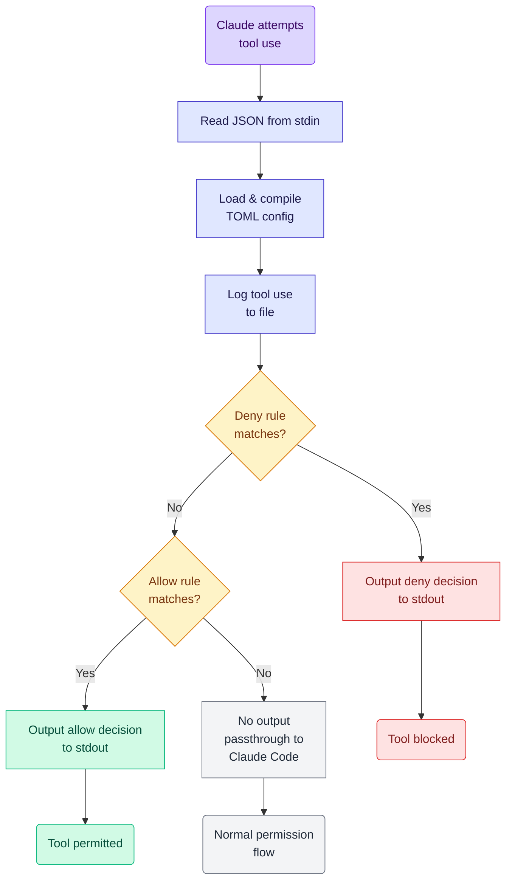

# Command Permissions Hook for Claude Code

A PreToolUse hook for Claude Code that provides granular control over which tools Claude can use, with support for allow/deny rules, pattern matching, and security exclusions.

NOTE this is largely a workaround of current (October 2025) limitations to how Claude Code does permissions - no amount of fiddling with [setting Bash permissions](https://docs.claude.com/en/docs/claude-code/iam#tool-specific-permission-rules) seems to work consistently - even for simple commands sometimes it prompts me over and over. So following their [Additional permission control with hooks](https://docs.claude.com/en/docs/claude-code/iam#additional-permission-control-with-hooks) guidelines, I thought I'd build a tool to help.

However this may well be a short-lived application; all the AI tools are moving very fast and I'm guessing Anthropic will improve these permissions soon. So I'm not packaging this up with a lot of help and guidance - use it if it helps, but you'll need to know how to build and run a rust application yourself, I'm afraid.

## Disclaimer

This has been largely "vibe coded" - I have checked all the code myself, but mostly just for flaws not for quality; I can't claim it is the best code out there! When time permits I might give it more love.

## Features

- All configuration is via a single `.toml` file - see [example.toml](./example.toml) for an example.
- You can allow tool/command combinations with specific regular-expression based filters
- You can also deny tool/command combinations similarly
- There is an extra "Allow X but not if Y matches" logic so you can keep regular expressions simpler for common cases
- Extensive logging is included - if you set logging to "verbose" it will log every PreToolUse call, very handy for diagnosing problems

## Installation

```bash
cargo build --release
```

The binary will be at `target/release/claude-code-permissions-hook`

## Configuration

Create a TOML configuration file (see `example.toml`):

```toml
[audit]
audit_file = "/tmp/claude-tool-use.json"
# Audit level: off, matched (default), all
# - off: no auditing
# - matched: audit only tool use that hits a rule (allow/deny)
# - all: audit everything including passthrough
audit_level = "matched"

# Allow rules - checked after deny rules
[[allow]]
tool = "Read"
file_path_regex = "^/Users/korny/Dropbox/prj/.*"
file_path_exclude_regex = "\\.\\."  # Block path traversal

[[allow]]
tool = "Bash"
command_regex = "^cargo (build|test|check|clippy|fmt|run)"
command_exclude_regex = "&|;|\\||`|\\$\\("  # Block shell injection

[[allow]]
tool = "Task"
subagent_type = "codebase-analyzer"

# Deny rules - checked first (take precedence)
[[deny]]
tool = "Bash"
command_regex = "^rm .*-rf"

[[deny]]
tool = "Read"
file_path_regex = "\\.(env|secret)$"
```

## Claude Code Setup

Add to `.claude/settings.json`:

```json
{
  "hooks": {
    "PreToolUse": [
      {
        "matcher": "*",
        "hooks": [
          {
            "type": "command",
            "command": "/path/to/claude-code-permissions-hook run --config ~/.config/claude-code-permissions-hook.toml"
          }
        ]
      }
    ]
  }
}
```

## Usage

### Validate Configuration

```bash
cargo run -- validate --config example.toml
```

### Run as Hook (reads JSON from stdin)

```bash
echo '<hook-input-json>' | cargo run -- run --config example.toml
```

### Run Tests

```bash
cargo test
```

See `tests/` directory for integration tests and sample JSON inputs.

## How It Works



### Flow Description

1. **Load Configuration**: Parse TOML and compile all regex patterns
2. **Read Hook Input**: Parse JSON from stdin containing tool name and parameters
3. **Log Tool Use**: Write to log file (non-fatal, won't block on errors)
4. **Check Deny Rules**: If any deny rule matches, output deny decision
5. **Check Allow Rules**: If any allow rule matches, output allow decision
6. **No Match**: Exit with no output (normal Claude Code permission flow)

### Rule Matching Logic

For each rule:

1. Check if tool name matches
2. Extract relevant field from tool_input (file_path, command, subagent_type, or prompt)
3. Check if main regex matches
4. If yes, check that exclude regex doesn't match
5. First match wins (deny rules checked first)

### Supported Tools

- **Read/Write/Edit/Glob**: Match on `file_path`
- **Bash**: Match on `command`
- **Task**: Match on `subagent_type` or `prompt`

## Security Patterns

### Path Traversal Prevention

```toml
[[allow]]
tool = "Read"
file_path_regex = "^/safe/directory/.*"
file_path_exclude_regex = "\\.\\."  # Block ../
```

### Shell Injection Prevention

```toml
[[allow]]
tool = "Bash"
command_regex = "^(cargo|git|npm) "
command_exclude_regex = "&|;|\\||`|\\$\\("  # Block shell metacharacters
```

### Sensitive File Protection

```toml
[[deny]]
tool = "Read"
file_path_regex = "\\.(env|secret|key)$"
```

## Development

```bash
cargo test      # Run tests
cargo clippy    # Lint code
cargo fmt       # Format code
```

## Logging

### Audit File (JSON)

(confusingly this used to be also called 'logging' - renamed to auditing now for clarity)

Records tool use to the file specified by `audit_file`. Controlled by `audit_level` in TOML:

- `off` - disabled
- `matched` (default) - records only allow/deny decisions
- `all` - records everything including passthrough

Format (one JSON object per line):

```json
{"timestamp":"2025-10-06T10:27:59Z","session_id":"abc123","tool_name":"Read","tool_input":{...},"decision":"allow","reason":"Matched rule...","cwd":"/path"}
```

### Diagnostic Log (stderr)

For debugging rule matching. Controlled by `RUST_LOG` environment variable:

```bash
RUST_LOG=debug cargo run -- run --config example.toml
```

## License

See LICENSE file for details.
